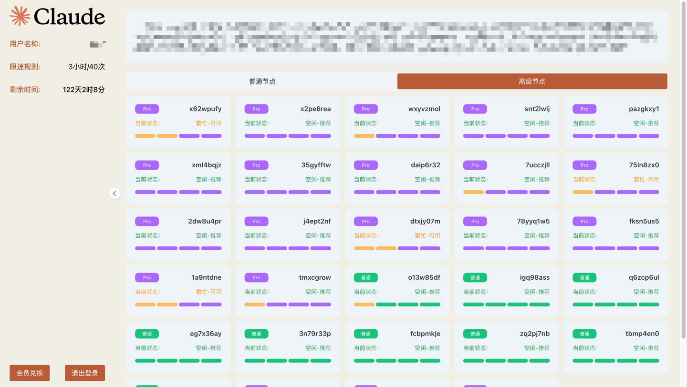
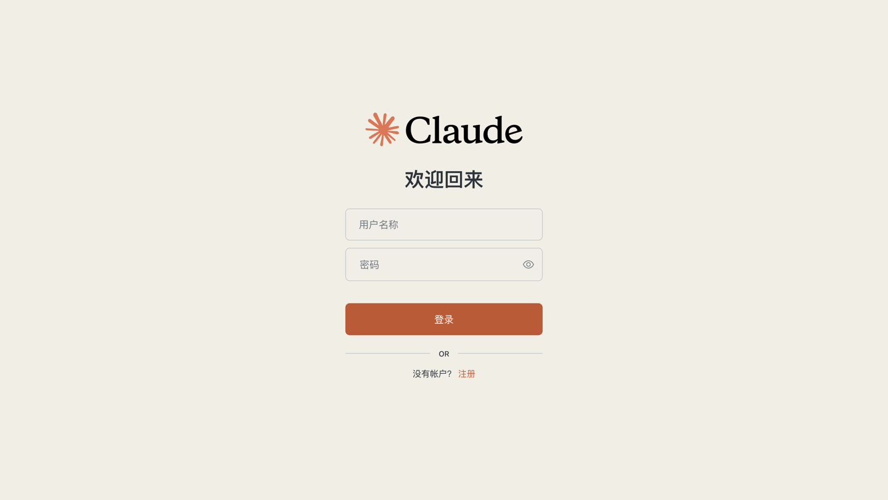
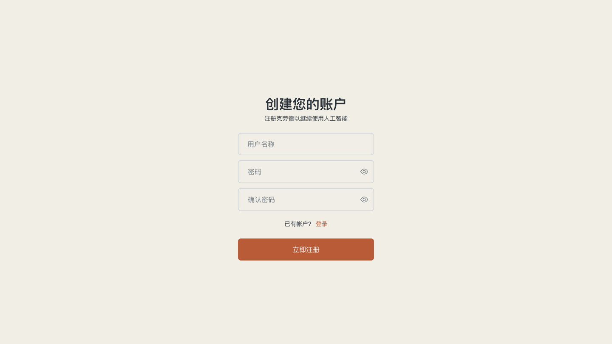
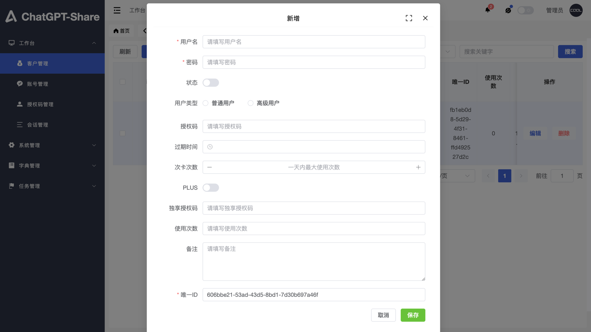

# Claude 项目体验 地址
用户端：https://claude-demo2.ainx.cc
账号密码：admin/123456
后台：https://claude-demo2.ainx.cc/u/login
账号密码：admin/123456
# soruxgpt-claude-share-deploy-extend

soruxgpt-claude-share-deploy 二开镜像

# 项目截图







# 部署方式
- 1、git clone https://github.com/frontend-winter/soruxgpt-claude-share-extend.git
- 2、修docker-compose.yml文件 
  - CHATPROXY （修改为你自己的网关，注意有两个地方需要修改）
  - AUTHKEY（修改为你自己的网关密钥，注意有两个地方需要修改）
- 3、./deploy.sh

# caddy 配置
```caddy
你的域名xxxxxx {
    # 全局代理头设置
    header {
        Strict-Transport-Security "max-age=31536000"
    }

    # 启用调试日志
    log {
        output stderr
        level DEBUG
    }

    # 处理 /list 路径的重定向问题
    @list {
        path /list /list/*
    }
    handle @list {
        reverse_proxy http://127.0.0.1:8301 {
            header_up Host {host}
            header_up X-Real-IP {remote}
            header_up X-Forwarded-For {remote}
            header_up X-Forwarded-Proto {scheme}
            # 禁用自动重定向
            header_down -Location
        }
    }

    # 处理 /exend 路径
    handle_path /exend/* {
        reverse_proxy http://127.0.0.1:8301 {
            header_up Host {host}
            header_up X-Real-IP {remote}
            header_up X-Forwarded-For {remote}
            header_up X-Forwarded-Proto {scheme}
        }
    }

    # 定义 @admin 匹配器，匹配 /admin 和 /admin/*
    @admin {
        path /admin /admin/*
    }
    handle @admin {
        reverse_proxy http://127.0.0.1:8301 {
            header_up Host {host}
            header_up X-Real-IP {remote}
            header_up X-Forwarded-For {remote}
            header_up X-Forwarded-Proto {scheme}
        }
    }

    # 处理 /xyhelper 路径的重定向问题
    @xyhelper {
        path /xyhelper /xyhelper/*
    }
    handle @xyhelper {
        reverse_proxy http://127.0.0.1:8301 {
            header_up Host {host}
            header_up X-Real-IP {remote}
            header_up X-Forwarded-For {remote}
            header_up X-Forwarded-Proto {scheme}
            # 禁用自动重定向
            header_down -Location
        }
    }

    # 处理 /u 路径
    @u {
        path /u /u/*
    }
    handle @u {
        reverse_proxy http://127.0.0.1:8301 {
            header_up Host {host}
            header_up X-Real-IP {remote}
            header_up X-Forwarded-For {remote}
            header_up X-Forwarded-Proto {scheme}
        }
    }

    # 默认处理器
    handle {
        reverse_proxy http://127.0.0.1:8300 {
            header_up Host {host}
            header_up X-Real-IP {remote}
            header_up X-Forwarded-For {remote}
            header_up X-Forwarded-Proto {scheme}
        }
    }
}
```

## 注意事项
- 端口不一样？把8300 和 8301 修改为指定的端口
- caddy 配置修改以及重启命令
  - vim /etc/caddy/Caddyfile
  - sudo systemctl restart caddy
  
# 项目配置

- CHATPROXY: 网关地址
- AUTHKEY: 网关鉴权密钥
- PORT: 端口
- OAUTH_URL: 登录鉴权地址（当登录时，若含有此项，则会POST此地址）
- AUDIT_LIMIT_URL: 鉴权地址（当对话时，会POST此地址）
- MY_SELF: 反代域名
- APIAUTH: API 调用密钥
- NOTIFY_URL: 通知地址，当成功完成一次对话时，会主动通知此地址
- ROAM_CONVERSATION: true/false 是否开启漫游
- LOG_OUT_AS_GO_TO_LIST: true/false 是否将左下角退出直接跳转到选车页面（即无需清空Session）
- SUIT_FOR_SHARE_IN_SESSION: 是否使用默认 SESSION，以兼容其他项目
- YES_CAPTCHA: 打码密钥

# Claude镜像部署遇到问题？wx联系：frontend-winter
